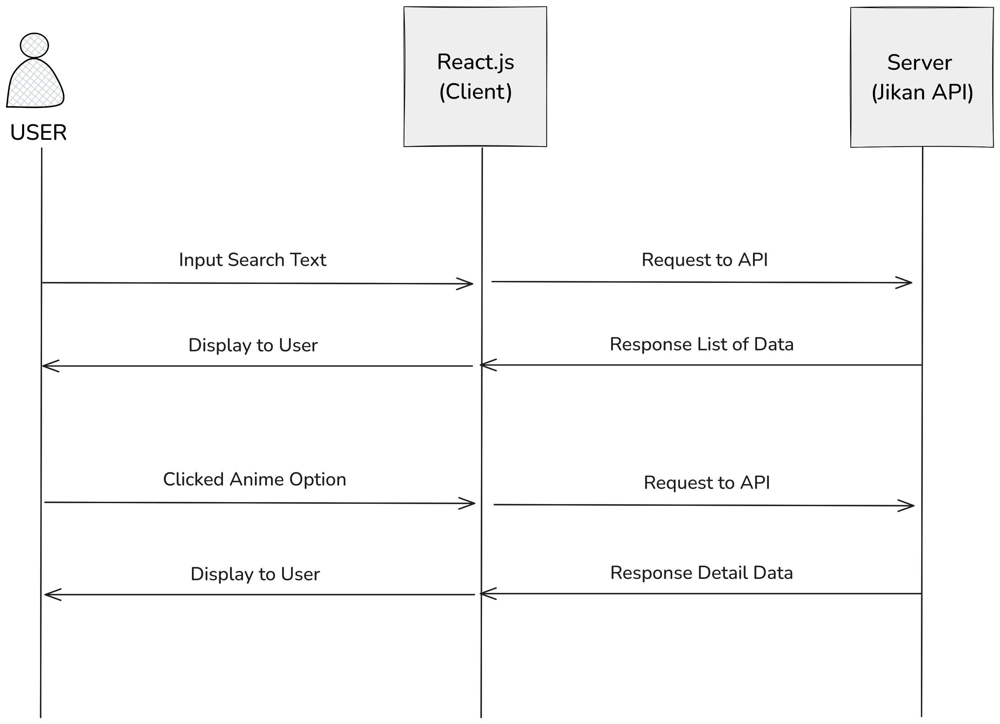
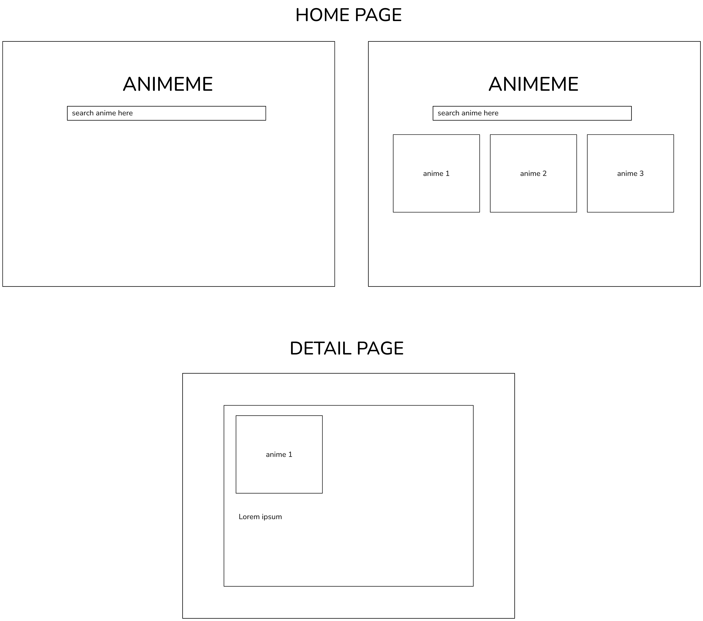

# Table of Contents

- [Table of Contents](#table-of-contents)
  - [Technical Documentation](#technical-documentation)
    - [High-level Design](#high-level-design)
    - [Wireframe Design](#wireframe-design)
    - [API Design Contract (Jikan API)](#api-design-contract-jikan-api)

## Technical Documentation

### High-level Design

###  Wireframe Design

### API Design Contract (Jikan API)

| Endpoint            | Method | Description                                                | Parameters / Request Body Details                                                                                                                                                      | Response Example       |
| ------------------- | ------ | ---------------------------------------------------------- | -------------------------------------------------------------------------------------------------------------------------------------------------------------------------------------- | ---------------------- |
| **/anime**          | GET    | Retrieve a list of animes                                  | **Query Parameters:**   - `q` (optional: string): Filter posts by query string   - `page` (optional: integer): page selection    - `limit` (integer) limit amount per request | Array of anime objects |
| **/anime/:id/full** | GET    | Retrieve a single anime by its ID with full of its details | **Path Parameter:**   - `id` (number): ID of the post                                                                                                                               | Single anime object    |

